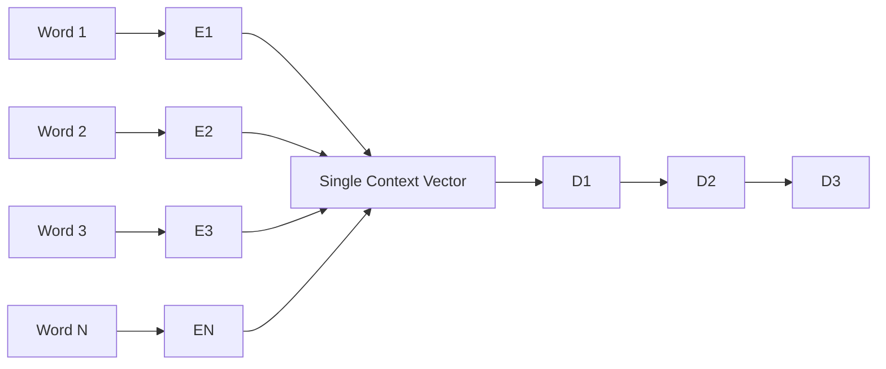
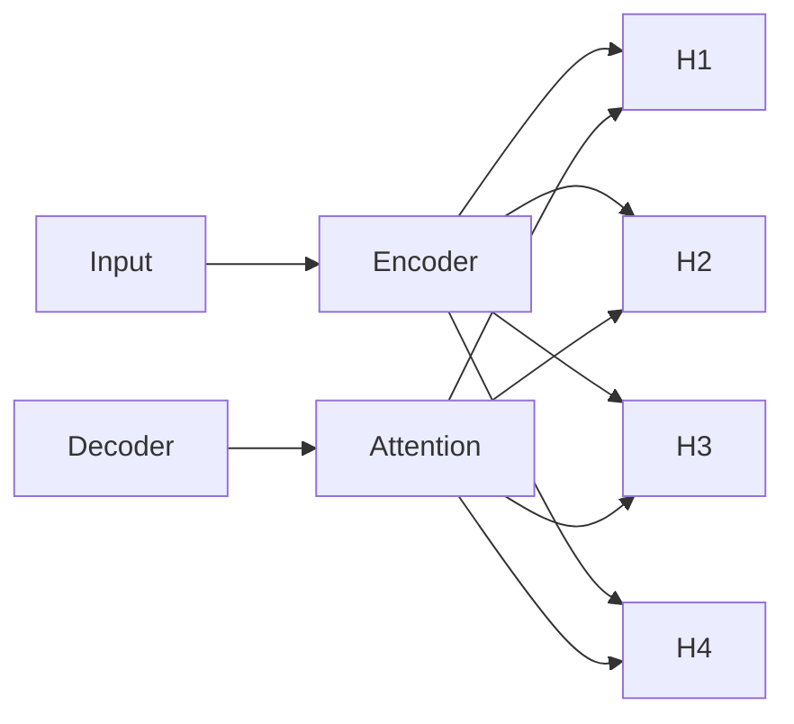
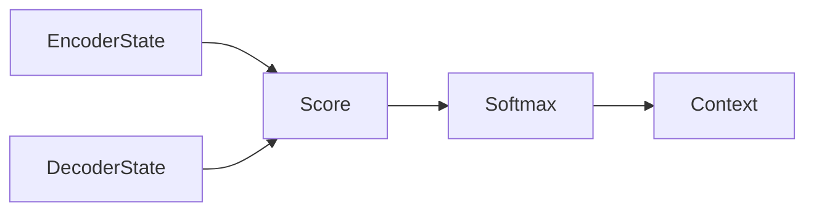
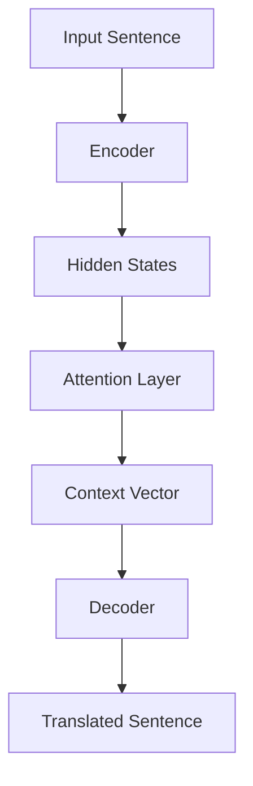
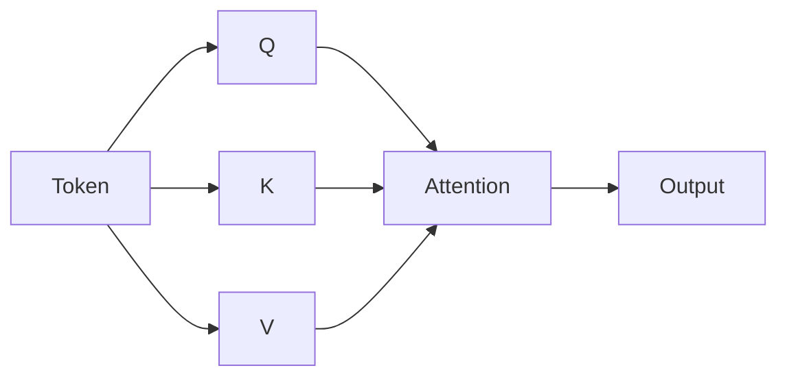
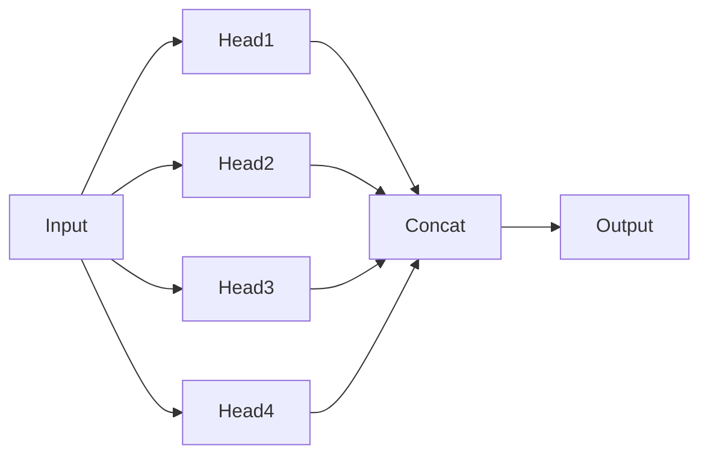
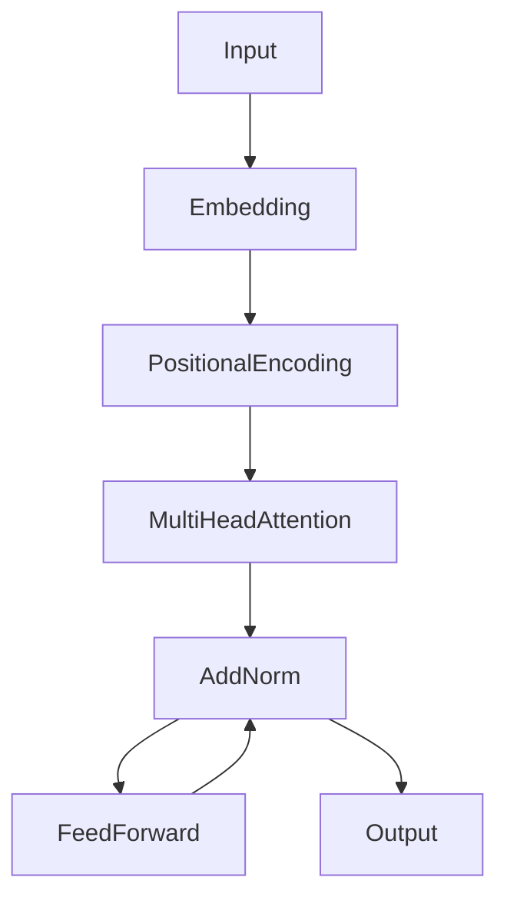

# 🧠 Complete Research Guide to Attention Mechanism

<p align="center">
  
  
  
</p>

---

# Table of Contents

1. Introduction
2. Why Attention Was Needed
3. The Encoder-Decoder Bottleneck
4. Intuition Behind Attention
5. Mathematical Foundation
6. Bahdanau Attention
7. Luong Attention
8. Attention Visualization
9. Attention in Machine Translation
10. Self-Attention
11. Query-Key-Value Mechanism
12. Multi-Head Attention
13. Transformer Architecture
14. Computational Analysis
15. Advantages and Limitations
16. Real-World Applications
17. Implementation from Scratch
18. Research Directions
19. References

---

# 1. Introduction

Attention Mechanism is one of the most influential innovations in Deep Learning.

It allows neural networks to dynamically focus on the most relevant portions of input data while generating outputs.

Human brains naturally perform attention:

Imagine reading a sentence:

> "The animal didn't cross the street because it was too tired."

When interpreting "it", humans automatically focus on "animal".

Attention mechanisms enable neural networks to perform similar selective focus.

---

# 2. Why Attention Was Needed

Before attention, machine translation relied on Encoder-Decoder architectures.

Input:

```
I love Machine Learning
```

Encoder:

```
Input Sentence
      ↓
Hidden States
      ↓
Single Context Vector
```

Decoder:

```
Context Vector
      ↓
Generated Translation
```

Problem:

All information must be compressed into a single vector.

Long sequences cause information loss.

Research showed performance degrades significantly as sentence length increases.

---

# 3. Encoder-Decoder Bottleneck

## Traditional Seq2Seq Architecture



### Major Limitation

Only one vector stores entire sentence information.

For long sequences:

```
Input Length ↑
Performance ↓
```

---

# 4. Intuition Behind Attention

Instead of using one context vector:

Allow decoder to look back at all encoder states.



The decoder decides:

> Which words are important right now?

---

# 5. Mathematical Foundation

Let encoder outputs be:

[
h_1,h_2,h_3,\ldots,h_n
]

Decoder state:

[
s_t
]

Attention score:

[
e_{tj}=score(s_t,h_j)
]

Softmax normalization:

[
\alpha_{tj}
===========

\frac{\exp(e_{tj})}
{\sum_k \exp(e_{tk})}
]

Context vector:

[
c_t
===

\sum_j \alpha_{tj} h_j
]

This weighted sum becomes the dynamic memory used by the decoder.

---

# 6. Bahdanau Attention (Additive Attention)

Published:

2014

Major breakthrough in Neural Machine Translation.

## Architecture



Score function:

[
e_{ij}
======

v^T
\tanh
(
W_h h_j
+
W_s s_i
)
]

Advantages:

* Better alignment
* Handles long sequences
* Learned attention scoring

---

# 7. Luong Attention

Introduced as a computationally efficient alternative.

Types:

1. Dot Attention
2. General Attention
3. Concat Attention

General Form:

[
score(h_t,s_t)
==============

h_t^TWs_t
]

Faster than Bahdanau Attention.

---

# 8. Attention Visualization

Example Translation:

```
I love deep learning
```

↓

```
J'aime l'apprentissage profond
```

Attention Matrix

| Output        | I   | Love | Deep | Learning |
| ------------- | --- | ---- | ---- | -------- |
| J'aime        | 0.8 | 0.2  | 0    | 0        |
| l'            | 0.1 | 0.6  | 0.3  | 0        |
| apprentissage | 0   | 0.1  | 0.4  | 0.5      |

Bright regions indicate stronger attention.

---

# 9. Machine Translation Pipeline



---

# 10. Self-Attention

Attention evolved further.

Instead of:

```
Decoder → Encoder
```

Now:

```
Word → Other Words
```

Each token attends to all tokens in the sequence.

Example:

```
The cat sat on the mat
```

Word:

```
cat
```

can attend to:

```
sat
mat
the
```

simultaneously.

---

# 11. Query Key Value Mechanism

Core innovation behind Transformers.

Every token produces:

* Query (Q)
* Key (K)
* Value (V)



Attention:

[
Attention(Q,K,V)
================

Softmax
\left(
\frac{QK^T}
{\sqrt{d_k}}
\right)V
]

---

# 12. Multi-Head Attention

Single attention learns one relationship.

Multi-head learns many relationships simultaneously.



Benefits:

* Better context
* Parallel learning
* Rich semantic representation

---

# 13. Transformer Architecture

The revolutionary architecture from:

**Attention Is All You Need (2017)**



Key innovation:

No RNN.

No LSTM.

Pure Attention.

---

# 14. Computational Complexity

| Method      | Complexity           |
| ----------- | -------------------- |
| RNN         | O(n) Sequential      |
| LSTM        | O(n) Sequential      |
| Attention   | O(n²) Parallel       |
| Transformer | O(n²) Fully Parallel |

Tradeoff:

Higher computation

↓

Much better scalability

---

# 15. Advantages

## Long Range Dependencies

Captures distant relationships.

## Parallelization

GPU-friendly architecture.

## Better Translation

Superior sequence modeling.

## Explainability

Attention maps can be visualized.

---

# 16. Limitations

### Quadratic Complexity

[
O(n^2)
]

Problem for:

* Long documents
* Videos
* Large contexts

### Memory Intensive

Large attention matrices.

---

# 17. Implementation from Scratch

```python
import torch
import torch.nn.functional as F

def attention(Q,K,V):

    scores = torch.matmul(
        Q,
        K.transpose(-2,-1)
    )

    scores = scores / (
        K.size(-1) ** 0.5
    )

    weights = F.softmax(
        scores,
        dim=-1
    )

    output = torch.matmul(
        weights,
        V
    )

    return output
```

---

# 18. Modern Research Directions

### Sparse Attention

Reduces quadratic complexity.

Examples:

* Longformer
* BigBird

### Linear Attention

Approximate attention efficiently.

### Flash Attention

GPU-optimized implementation.

### Retrieval-Augmented Attention

External memory integration.

### Multimodal Attention

Used in:

* GPT-4 Vision
* Flamingo
* BLIP
* LLaVA

---

# 19. Real World Applications

## NLP

* Translation
* Summarization
* Chatbots

## Computer Vision

* Vision Transformers
* Image Captioning

## Healthcare

* Medical Diagnosis

## Finance

* Stock Forecasting

## Autonomous Vehicles

* Scene Understanding

---

# Final Summary

Attention Mechanism solved the major limitation of Seq2Seq models by allowing neural networks to dynamically focus on relevant parts of the input rather than compressing all information into a single vector. This innovation led to Self-Attention, Multi-Head Attention, and ultimately the Transformer architecture that powers modern systems such as GPT, BERT, T5, LLaMA, Gemini, and Claude.

---

# References

1. Bahdanau et al. (2014) – Neural Machine Translation by Jointly Learning to Align and Translate
2. Luong et al. (2015) – Effective Approaches to Attention-based Neural Machine Translation
3. Vaswani et al. (2017) – Attention Is All You Need
4. Attention Mechanism Survey (2018)
5. Encoder-Decoder Attention Analysis (2021)

---

© Uditya Narayan Tiwari
