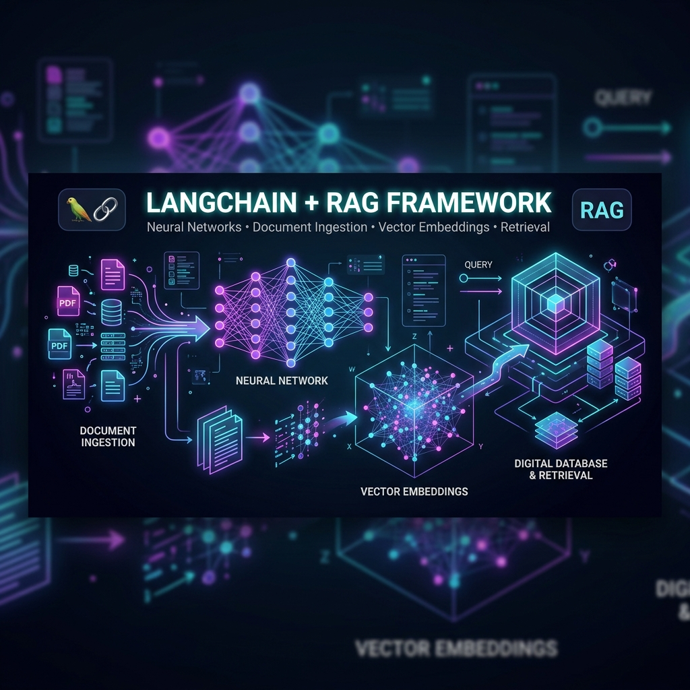
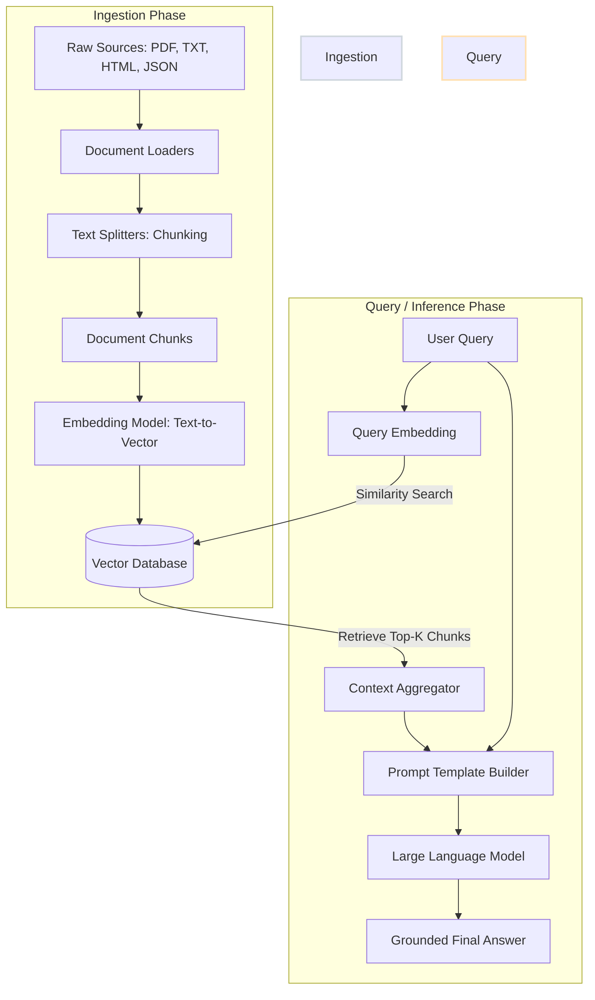
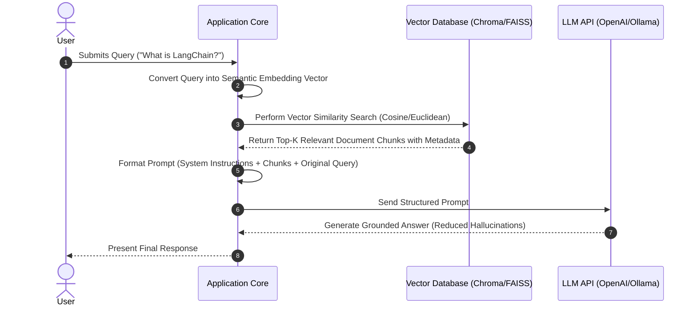

# 🦜 LangChain RAG Pipeline: Complete Developer Guide

<p align="center">
  
</p>

<p align="center">
  <a href="https://www.python.org/"></a>
  <a href="https://python.langchain.com/"></a>
  <a href="https://openai.com/"></a>
  <a href="https://ollama.com/"></a>
  <a href="https://huggingface.co/"></a>
  <a href="https://github.com/facebookresearch/faiss"></a>
  <a href="https://www.trychroma.com/"></a>
</p>

---

## 📚 Overview

This repository is an in-depth developer guide to understanding, building, and optimizing **Retrieval-Augmented Generation (RAG) Pipelines** using the **LangChain** ecosystem. It covers everything from raw data ingestion and advanced splitting techniques to generating semantic embeddings and performing high-performance similarity searches in local and cloud vector databases.

By walking through the Jupyter notebooks in this repository, you will learn how to transition from traditional keyword search to semantic search using APIs (OpenAI) and local frameworks (Ollama, Hugging Face), and how to manage index persistence with database engines like FAISS and Chroma DB.

---

## 🗺️ Table of Contents
1. [🏗️ RAG Pipeline Architecture](#-rag-pipeline-architecture)
2. [📂 Repository Directory Structure](#-repository-directory-structure)
3. [📓 Notebook-by-Notebook Walkthrough](#-notebook-by-notebook-walkthrough)
   - [01. Data Ingestion](#01-data-ingestion)
   - [02. Text Splitting](#02-text-splitting)
   - [03. HTML Text Splitting](#03-html-text-splitting)
   - [04. Recursive JSON Splitting](#04-recursive-json-splitting)
   - [05. OpenAI Embeddings & Chroma DB](#05-openai-embeddings--chroma-db)
   - [06. Ollama Embeddings](#06-ollama-embeddings)
   - [07. HuggingFace Embeddings](#07-huggingface-embeddings)
   - [08. FAISS Vector Database](#08-faiss-vector-database)
   - [09. Chroma DB Persistence](#09-chroma-db-persistence)
4. [📊 Comparative Analysis](#-comparative-analysis)
   - [Text Splitters Comparison](#text-splitters-comparison)
   - [Vector Databases Comparison](#vector-databases-comparison)
   - [Embedding Providers Comparison](#embedding-providers-comparison)
5. [⚙️ Setup & Prerequisites](#%EF%B8%8F-setup--prerequisites)
6. [📖 Academic & Reference Papers](#-academic--reference-papers)
7. [👨‍💻 About the Author](#-about-the-author)

---

## 🏗️ RAG Pipeline Architecture

Retrieval-Augmented Generation addresses Large Language Model (LLM) limitations like hallucinations, knowledge cutoff, and access to private information by feeding contextual snippets into the prompt space at query time.

### Core Data Flow (Ingestion & Retrieval)



### End-to-End Sequence Diagram




---

## 📓 Notebook-by-Notebook Walkthrough

### 01. Data Ingestion
* **Goal:** Convert raw formats (TXT, PDF, Web Pages, Wikipedia) into standardized LangChain `Document` objects containing `page_content` and `metadata` dicts.
* **Key Components:**
  * `TextLoader`: Standard system text loading.
  * `PyPDFLoader`: Page-by-page PDF extraction with positional metadata.
  * `WebBaseLoader`: Pulls web pages (leveraging `BeautifulSoup` to parse specific tags).
  * `WikipediaLoader`: Queries Wikipedia API directly for target search queries.

```python
from langchain_community.document_loaders import TextLoader, PyPDFLoader, WebBaseLoader, WikipediaLoader

# Loading a local PDF
loader = PyPDFLoader('Uditya_Narayan_Tiwari_resume.pdf')
pdf_doc = loader.load()

# Scraping website data
web_loader = WebBaseLoader(
    web_paths=["https://lilianweng.github.io/posts/2023-06-23-agent/"],
    bs_kwargs=dict(parse_only=bs4.SoupStrainer(class_=("post-content", "post-title")))
)
web_doc = web_loader.load()
```

### 02. Text Splitting
* **Goal:** Chunk documents to fit LLM input token restrictions and ensure high semantic focus per chunk.
* **Key Components:**
  * `CharacterTextSplitter`: Splitting on hardcoded delimiters (e.g. `\n\n`).
  * `RecursiveCharacterTextSplitter`: Dynamically splits on a prioritised list of characters `["\n\n", "\n", " ", ""]` to avoid splitting sentences or words across chunks.

```python
from langchain_text_splitters import RecursiveCharacterTextSplitter

text_splitter = RecursiveCharacterTextSplitter(
    chunk_size=500,
    chunk_overlap=50
)
chunks = text_splitter.split_documents(pdf_doc)
```

### 03. HTML Text Splitting

* **Goal:** Intelligently partition HTML web files using their semantic structures (`<h1>`, `<h2>`, etc.) so that nested content keeps its structural header context.
* **Key Components:**
  * `HTMLHeaderTextSplitter`: Groups text under matching headers and adds parent header names directly into the metadata dictionary of each chunk.

```python
from langchain_text_splitters import HTMLHeaderTextSplitter

headers_to_split_on = [
    ("h1", "Header 1"),
    ("h2", "Header 2"),
    ("h3", "Header 3")
]
html_splitter = HTMLHeaderTextSplitter(headers_to_split_on=headers_to_split_on)
html_header_split = html_splitter.split_text_from_url("https://example.com")
```

### 04. Recursive JSON Splitting

* **Goal:** Keep nested structural JSON parameters intact while splitting data into small blocks so it is easily searchable.
* **Key Components:**
  * `RecursiveJsonSplitter`: Traverses JSON hierarchy recursively. Prevents structural details from being mangled or separated from key value contexts.

```python
from langchain_text_splitters import RecursiveJsonSplitter

splitter = RecursiveJsonSplitter(max_chunk_size=300)
json_chunks = splitter.split_json(json_data)
# Can output raw text list or LangChain Document objects
docs = splitter.create_documents(texts=[json_data])
```

### 05. OpenAI Embeddings & Chroma DB

* **Goal:** Vectorize text using state-of-the-art OpenAI models and run quick similarity searches in Chroma.
* **Key Components:**
  * `OpenAIEmbeddings`: Integrates with model versions like `text-embedding-3-large`.
  * Allows customizable dimensions (e.g. shrinking vector coordinates to `dimensions=1024` for reduced RAM usage).

```python
from langchain_openai import OpenAIEmbeddings
from langchain_community.vectorstores import Chroma

# High-dimensional embeddings with size adjustment
embeddings = OpenAIEmbeddings(model="text-embedding-3-large", dimensions=1024)
db = Chroma.from_documents(final_doc, embeddings)
retrieved_results = db.similarity_search("Who is the author?")
```

### 06. Ollama Embeddings

* **Goal:** Create embeddings completely offline using local weights.
* **Key Components:**
  * `OllamaEmbeddings`: Interfaces with models running locally inside Ollama containers (e.g., `llama3`, `mistral`, or dedicated embedding models like `nomic-embed-text`).

```python
from langchain_community.embeddings import OllamaEmbeddings

embeddings = OllamaEmbeddings(model="nomic-embed-text")
query_result = embeddings.embed_query("Who is the author?")
```

### 07. HuggingFace Embeddings
* **Goal:** Leverage the extensive library of transformer-based sentence encoders hosted on Hugging Face.
* **Key Components:**
  * `HuggingFaceEmbeddings`: Downloads and executes pipelines locally. Default lightweight candidate is `all-MiniLM-L6-v2`.

```python
from langchain_huggingface import HuggingFaceEmbeddings

embeddings = HuggingFaceEmbeddings(model_name="all-MiniLM-L6-v2")
doc_result = embeddings.embed_documents(["First document text", "Second document text"])
```

### 08. FAISS Vector Database
* **Goal:** Use Facebook AI Similarity Search (FAISS) to run ultra-fast CPU/GPU vector indices, save them locally, and reload indices securely.
* **Key Components:**
  * `FAISS`: Local vector store manager.
  * Methods demonstrated: `similarity_search`, `similarity_search_with_score` (returns raw distances alongside documents), `similarity_search_by_vector`.
  * `db.save_local` and `FAISS.load_local` using `allow_dangerous_deserialization=True` settings.

```python
from langchain_community.vectorstores import FAISS

db = FAISS.from_documents(docs, embeddings)
db.save_local("faiss_local_index")

# Loading index from file system
new_db = FAISS.load_local(
    folder_path="faiss_local_index", 
    embeddings=embeddings, 
    allow_dangerous_deserialization=True
)
results = new_db.similarity_search_with_score("What is the author's GPA?")
```

### 09. Chroma DB Persistence
* **Goal:** Persist data in a structural SQLite database managed by Chroma DB.
* **Key Components:**
  * `persist_directory`: Explicit local filepath setup.
  * Reloads the persistent database without recomputing embeddings from scratch.

```python
from langchain_chroma import Chroma

# Writing index with a persistent storage directory
vector_db = Chroma.from_documents(
    documents=split, 
    embedding=embeddings, 
    persist_directory="./chroma_db"
)

# Reading from directory later
loaded_db = Chroma(
    persist_directory="./chroma_db", 
    embedding_function=embeddings
)
docs = loaded_db.similarity_search(query)
```

---

## 📊 Comparative Analysis

### Text Splitters Comparison

| Splitter Type | Main Separation Anchor | Best Use Cases | Pros | Cons |
| :--- | :--- | :--- | :--- | :--- |
| **Recursive Character** | Paragraphs, sentences, words | Markdown, standard text files, code bases | Retains local contextual flow; highly configurable | Slower chunk calculation times |
| **Character** | Hardcoded user token (e.g. `\n\n`) | Evenly structured pages, raw logs | Incredibly simple; fast execution | Breaks up sentences; risks splitting ideas in half |
| **HTML Header** | Headings (`<h1>` - `<h6>`) | Rich web articles, official FAQs | Captures parent headings in metadata | Fails if page has inconsistent styling tags |
| **Recursive JSON** | Key hierarchies, bracket nesting | Configs, API logs, schema records | Keeps nested JSON structures intact | Chunks can quickly exceed context size limit |

### Vector Databases Comparison

| Feature | FAISS (Facebook AI Similarity Search) | Chroma DB |
| :--- | :--- | :--- |
| **Primary Design** | Heavy vector clustering & search speed | Full database functionalities (CRUD) |
| **Underlying Engine** | Optimized C++ libraries with index structures | SQLite + DuckDB engine |
| **Storage Style** | Memory-resident (flushed to bin files) | Disk-persistent SQL structure |
| **Best Used For** | Thousands to millions of dense vectors; production search engines | Fast local prototyping; metadata-heavy applications |
| **Pros** | Scalable, high search speeds | Metadata filtering out-of-the-box, easy setup |
| **Cons** | Deserialization configuration is complex | Indexing speed is slower for huge datasets |

### Embedding Providers Comparison

| Provider | Model Name | Local vs. API | Dimension Size | Pros | Cons |
| :--- | :--- | :--- | :--- | :--- | :--- |
| **OpenAI** | `text-embedding-3-large` | Cloud API | Up to 3072 | State-of-the-art accuracy, configurable sizes | Cost per token, requires internet access |
| **Ollama** | `nomic-embed-text` | Local Execution | 768 | Local, private, free, supports GPU | Requires high local CPU/GPU resource |
| **Hugging Face**| `all-MiniLM-L6-v2` | Local execution | 384 | Fast, tiny footprint, works offline | Lower semantic retrieval quality |

---

## ⚙️ Setup & Prerequisites

### 1. Installation
Install core requirements for the notebooks using pip:

```bash
pip install langchain langchain-community langchain-openai langchain-huggingface langchain-chroma faiss-cpu bs4 pypdf arxiv wikipedia requests python-dotenv
```

### 2. Environment Variables
To use cloud APIs, create a `.env` file in the root directory:

```env
OPENAI_API_KEY="your-openai-api-key-here"
HF_TOKEN="your-huggingface-read-token-here"
```

### 3. Ollama (For Local Models)
If running Ollama:
1. Download and install Ollama from [ollama.com](https://ollama.com).
2. Pull the embedding model in your terminal:
   ```bash
   ollama pull nomic-embed-text
   ```
3. Run the Ollama background daemon.

---

## 📖 Academic & Reference Papers

Here are the foundational research papers that cover RAG concepts and transformers:

1. **Retrieval-Augmented Generation for Knowledge-Intensive NLP Tasks** (Lewis et al., 2020)
   - *Key takeaway:* Introduced RAG architecture combining a pre-trained generator with a dense passage retriever.
   - [arXiv Link](https://arxiv.org/abs/2005.11401)
2. **Attention Is All You Need** (Vaswani et al., 2017)
   - *Key takeaway:* Introduced the Transformer architecture and attention mechanism, which powers all modern embedding and generation models.
   - [arXiv Link](https://arxiv.org/abs/1706.03762)
3. **Dense Passage Retrieval for Open-Domain Question Answering** (Karpukhin et al., 2020)
   - *Key takeaway:* Demonstrated that embeddings can outperform traditional TF-IDF/BM25 retrieval on QA tasks.
   - [arXiv Link](https://arxiv.org/abs/2004.04906)
4. **REALM: Retrieval-Augmented Language Model Pre-Training** (Guu et al., 2020)
   - *Key takeaway:* Developed a framework to train retrievers and generators jointly to retrieve documents from large corpora.
   - [arXiv Link](https://arxiv.org/abs/2002.08909)

---

## 👨‍💻 About the Author

### Uditya Narayan Tiwari
*B.Tech in Computer Science and Engineering (Specialization in AI & ML) | VIT Bhopal University*

I am passionate about building intelligent systems using machine learning and data-driven approaches to solve real-world problems. I work extensively with Python, PyTorch, TensorFlow, Scikit-learn, Pandas, and cloud platforms like Google Cloud and AWS.

#### Highlight Projects:
* **AIOPharmacy:** An intelligent medicine recommendation system that leverages Sentence Transformers for deep semantic understanding and uses the Maximal Marginal Relevance (MMR) algorithm to return diverse and relevant pharmaceutical recommendations based on voice/text symptoms.
* **Breast Cancer Diagnostic Predictor:** Implemented multiple machine learning algorithms using Scikit-learn to classify diagnostic data as benign or malignant.
* **Credit Card Approval Classifier:** A feature-engineered classification model evaluating approval metrics on applicant datasets.

#### Let's Connect:
* 🔗 **Portfolio:** [udityanarayantiwari.netlify.app](https://udityanarayantiwari.netlify.app/)
* 🔗 **GitHub Profile:** [@udityamerit](https://github.com/udityamerit)
* 🔗 **Knowledge Base:** [udityaknowledgebase.netlify.app](https://udityaknowledgebase.netlify.app/)
* 🔗 **LinkedIn:** [Uditya Narayan Tiwari on LinkedIn](https://www.linkedin.com/in/uditya-narayan-tiwari-562332289/)

---
⭐ *If you found this repository or guide useful, consider giving it a star!*
