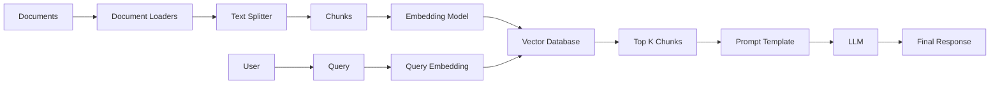
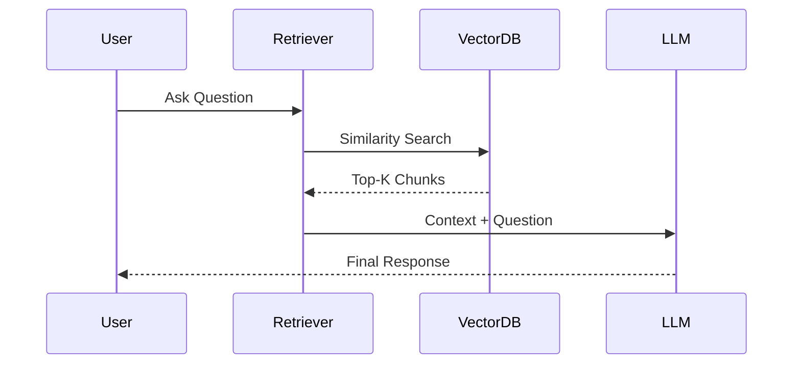
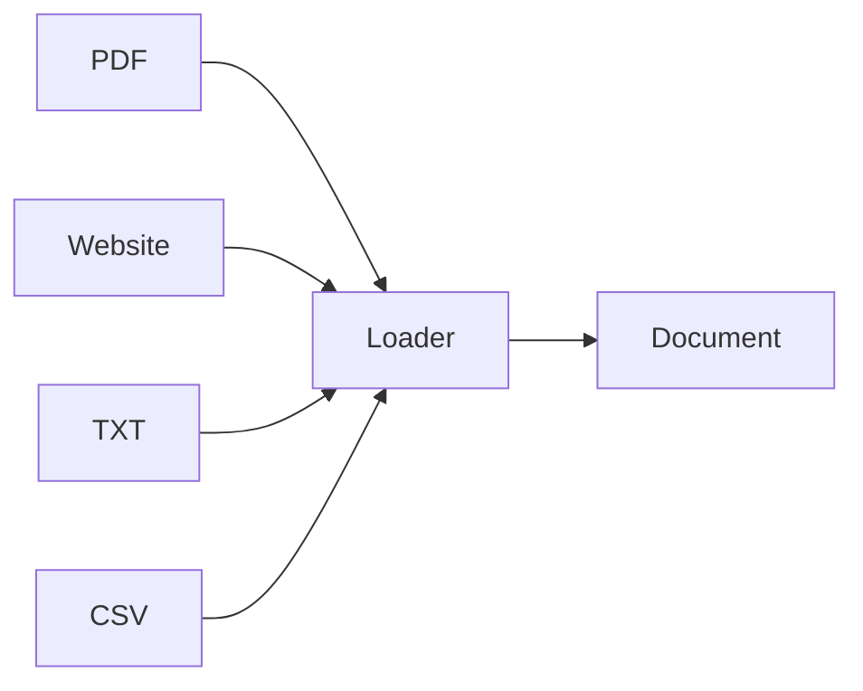
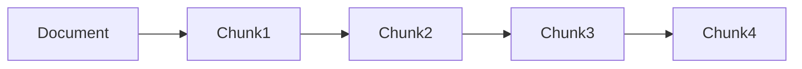
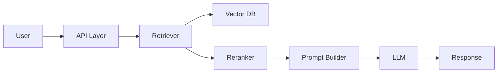

# 🦜 LangChain RAG Pipeline: Complete Developer Guide

<p align="center">


</p>

---

# 📚 Overview

This repository provides a complete understanding of the **Retrieval-Augmented Generation (RAG) Pipeline** using LangChain.

RAG enables Large Language Models (LLMs) to retrieve external knowledge before generating responses, reducing hallucinations and improving factual accuracy.

The repository covers:

* Data Ingestion
* Text Splitting
* Embeddings
* Vector Databases
* Retrieval
* Similarity Search
* Production RAG Architecture
* Mathematical Foundations
* Advanced Retrieval Techniques

---

# 🎯 Why RAG?

Traditional LLMs:

```text
Question
    ↓
LLM
    ↓
Answer
```

Problems:

* Hallucinations
* Outdated knowledge
* No access to private documents

RAG:

```text
Question
    ↓
Retriever
    ↓
Relevant Documents
    ↓
LLM
    ↓
Grounded Answer
```

Benefits:

✅ Reduced hallucination

✅ Private knowledge integration

✅ Domain-specific expertise

✅ Real-time updates

---

# 🏗 Complete RAG Architecture



---

# 🔄 End-to-End Data Flow



---

# ⚙️ Stage 1: Data Ingestion

## Purpose

Convert raw data into LangChain Documents.

## Supported Sources

| Source    | Loader          |
| --------- | --------------- |
| PDF       | PyPDFLoader     |
| Website   | WebBaseLoader   |
| TXT       | TextLoader      |
| CSV       | CSVLoader       |
| Directory | DirectoryLoader |

## Workflow



## Example

```python
from langchain_community.document_loaders import PyPDFLoader

loader = PyPDFLoader("paper.pdf")

docs = loader.load()
```

---

# ✂️ Stage 2: Text Splitting

## Why Split?

LLMs have context limitations.

A 200-page document cannot be embedded as one chunk.

## Workflow



## Recommended Settings

```python
chunk_size = 500

chunk_overlap = 50
```

## Recursive Character Splitter

```python
from langchain.text_splitter import RecursiveCharacterTextSplitter

splitter = RecursiveCharacterTextSplitter(
    chunk_size=500,
    chunk_overlap=50
)

chunks = splitter.split_documents(docs)
```

---

# 🧠 Stage 3: Embeddings

Embeddings transform text into vectors.

Example:

```text
"The cat sits on the mat"

↓

[0.23, -0.89, 0.45, ...]
```

## Mathematical Foundation

Cosine Similarity:

```math
sim(q,c)=\frac{q\cdot c}{||q|| ||c||}
```

Higher similarity means greater semantic relevance.

## Workflow

```mermaid
flowchart LR

Text

--> Embedding Model

--> Vector
```

## OpenAI Embeddings

```python
from langchain_openai import OpenAIEmbeddings

embedding = OpenAIEmbeddings(
    model="text-embedding-3-small"
)
```

---

# 🗄 Stage 4: Vector Database

Store embeddings efficiently.

## Architecture

```mermaid
flowchart LR

Chunks

--> Embeddings

--> VectorDB

Query

--> Query Embedding

--> VectorDB

VectorDB

--> Top K Results
```

## Popular Databases

| Database | Type       |
| -------- | ---------- |
| FAISS    | Local      |
| Chroma   | Local      |
| Pinecone | Cloud      |
| Weaviate | Hybrid     |
| PGVector | PostgreSQL |

---

# 🔍 Stage 5: Retrieval

At query time:

1. Embed user query
2. Compare against stored vectors
3. Return Top-K chunks

## Retrieval Workflow

```mermaid
flowchart LR

Question

--> Query Embedding

--> Similarity Search

--> Top K Chunks

--> Prompt

--> LLM

--> Answer
```

---

# 📐 Similarity Search

## Cosine Similarity

```math
\text{sim}(A,B)=
\frac{A\cdot B}
{|A||B|}
```

## Euclidean Distance

```math
d(A,B)=
\sqrt{\sum_{i=1}^{n}(A_i-B_i)^2}
```

## Dot Product

```math
A\cdot B
=
\sum A_iB_i
```

---

# 🚀 Production RAG Architecture



---

# 🎯 Advanced Retrieval Methods

## Similarity Search

```python
retriever = db.as_retriever()
```

---

## MMR Retrieval

Maximal Marginal Relevance

```python
retriever = db.as_retriever(
    search_type="mmr"
)
```

---

## Hybrid Search

```text
BM25
 +
Vector Search
 =
Hybrid Retrieval
```

---

# 🛠 Complete LangChain Pipeline

```python
loader = PyPDFLoader("paper.pdf")

docs = loader.load()

splitter = RecursiveCharacterTextSplitter(
    chunk_size=500,
    chunk_overlap=50
)

chunks = splitter.split_documents(docs)

embeddings = OpenAIEmbeddings()

db = FAISS.from_documents(
    chunks,
    embeddings
)

retriever = db.as_retriever()

query = "What is LangChain?"

docs = retriever.get_relevant_documents(query)
```

---

# 📊 RAG vs Fine-Tuning

| Feature                 | RAG  | Fine-Tuning |
| ----------------------- | ---- | ----------- |
| Dynamic Knowledge       | ✅    | ❌           |
| Cost                    | Low  | High        |
| Updates                 | Easy | Hard        |
| Hallucination Reduction | High | Medium      |
| Training Required       | No   | Yes         |

---

# 📖 Research Papers

### Foundational Papers

1. Retrieval-Augmented Generation for Knowledge-Intensive NLP Tasks

2. Attention Is All You Need

3. Dense Passage Retrieval for Open-Domain Question Answering

4. REALM: Retrieval-Augmented Language Model Pre-Training

5. FiD: Fusion-in-Decoder

---

# 🎓 Learning Outcomes

After completing this repository, you will understand:

* LangChain Architecture
* RAG Fundamentals
* Embedding Models
* Vector Databases
* Similarity Search
* Retrieval Strategies
* Production Deployment
* Advanced Retrieval Techniques

---

# 👨‍💻 Author

## Uditya Narayan Tiwari

B.Tech CSE (AI & ML) | VIT Bhopal

🔗 Portfolio: https://udityanarayantiwari.netlify.app/

🔗 GitHub: https://github.com/udityamerit

🔗 Knowledge Base: https://udityaknowledgebase.netlify.app/

🔗 LinkedIn: https://www.linkedin.com/in/uditya-narayan-tiwari-562332289/

---

⭐ If you found this repository useful, consider giving it a star.
