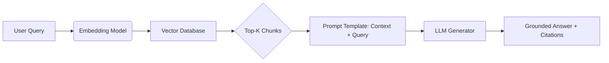

The user wants an article on "RAG".
RAG usually stands for **Retrieval-Augmented Generation** in the context of AI/LLMs.
It could also stand for "Red/Amber/Green" status reporting, "Random Access Generator", or a few other niche acronyms, but RAG (Retrieval-Augmented Generation) is by far the most requested topic currently.
I will write a comprehensive article on **Retrieval-Augmented Generation**.# Retrieval-Augmented Generation (RAG): The Definitive Guide to Grounding LLMs in Truth

**By [Your Name/AI Assistant] | Date: October 2026**

---

## Executive Summary
Large Language Models (LLMs) are remarkable reasoning engines, but they suffer from a critical flaw: **parametric knowledge cutoff** and **hallucination**. They only "know" what was in their training data, and they confidently fabricate answers when uncertain.

**Retrieval-Augmented Generation (RAG)** is the dominant architectural pattern solving this. It connects LLMs to external, authoritative knowledge bases (documents, databases, APIs) in real-time, enabling **grounded, verifiable, and up-to-date** generative AI applications.

---

## 1. The Problem: Why LLMs Aren't Enough
Before understanding RAG, we must understand the limitations of "vanilla" LLMs:

| Limitation | Description | Business Risk |
| :--- | :--- | :--- |
| **Knowledge Cutoff** | Model weights are frozen after training. It knows nothing of events, products, or regulations after that date. | Legal non-compliance; outdated product advice. |
| **Hallucination** | Models predict probable tokens, not verified facts. They invent citations, numbers, and policies. | Reputational damage; financial liability; safety risks. |
| **Black Box** | No citations. Users cannot verify *why* the model answered that way. | Lack of trust; regulatory audit failure (e.g., EU AI Act). |
| **Private Data Blindness** | Models never saw your internal PDFs, Confluence pages, SQL databases, or Slack history. | Inability to answer org-specific questions ("What is our PTO policy?"). |

---

## 2. What is RAG? (The Core Concept)
Coined by **Lewis et al. (Meta AI, 2020)** in the paper *"Retrieval-Augmented Generation for Knowledge-Intensive NLP Tasks,"* RAG shifts the paradigm:

> **"Don't ask the model to *remember*. Ask the model to *read*."**

### The RAG Loop (3 Stages)
1.  **Retrieval (Search):** Convert user query $\rightarrow$ Vector Embedding $\rightarrow$ Search Vector DB $\rightarrow$ Return Top-$k$ relevant chunks.
2.  **Augmentation (Context Injection):** Stuff retrieved chunks + User Query + System Prompt $\rightarrow$ LLM Context Window.
3.  **Generation (Synthesis):** LLM generates answer *conditioned strictly on provided context*.



---

## 3. Deep Dive: The RAG Pipeline Components

### A. Data Ingestion & Preparation (Offline/Batch)
*   **Source Connectors:** PDFs, HTML, Notion, Confluence, Git, SQL, Slack, Jira, Audio/Video (via Whisper).
*   **Parsing/Extraction:** `Unstructured.io`, `LlamaParse`, `PyMuPDF`, `Tika`. *Critical: Handle tables, charts, headers/footers correctly.*
*   **Chunking Strategy (The #1 Performance Lever):**
    *   *Fixed Size:* Simple, breaks semantic flow.
    *   *Recursive/Semantic:* Splits by headers $\rightarrow$ paragraphs $\rightarrow$ sentences (LangChain `RecursiveCharacterTextSplitter`).
    *   *Agentic/Propositional:* Uses LLM to extract atomic facts (expensive, high precision).
    *   *Parent Document Retrieval:* Store small chunks for embedding, retrieve large parent chunks for context.
*   **Metadata Enrichment:** Add `source`, `date`, `author`, `version`, `access_control_tags` (for RBAC filtering later).

### B. Indexing & Storage
*   **Vector Databases (ANNS):** Pinecone, Weaviate, Milvus, Qdrant, Chroma, PGVector (Postgres), Elasticsearch/OpenSearch.
    *   *Algorithms:* HNSW (Hierarchical Navigable Small World), IVF (Inverted File Index), DiskANN.
*   **Hybrid Search (Best Practice):** Combine **Dense Vectors** (semantic meaning) + **Sparse Vectors/BM25** (exact keyword matching: error codes, SKUs, proper nouns).
*   **Knowledge Graphs (GraphRAG):** Entities + Relationships. Enables multi-hop reasoning ("Who is the manager of the engineer who fixed bug #404?").

### C. Retrieval Strategies (Online/Real-time)
*Basic "Top-K" is rarely enough for production.*

| Strategy | Mechanism | Use Case |
| :--- | :--- | :--- |
| **Query Rewriting / Expansion** | LLM rewrites user query into 3-5 sub-queries (HyDE, Step-back prompting). | Vague queries; multi-faceted questions. |
| **Re-ranking (Cross-Encoders)** | Bi-encoder (fast) retrieves 50 $\rightarrow$ Cross-encoder (slow, accurate) scores top 50 $\rightarrow$ Return top 5. | **Essential for production quality.** Models: `bge-reranker-v2`, `Cohere Rerank`, `Jina Reranker`. |
| **Metadata Filtering (Pre-filter)** | Filter Vector DB by `department=Engineering` AND `year=2024` *before* vector search. | Security (RBAC); Temporal queries; Multi-tenancy. |
| **Query Routing** | Classify query $\rightarrow$ Route to SQL DB (structured) vs Vector DB (unstructured) vs Web Search. | Text-to-SQL; Heterogeneous data sources. |
| **Self-Query / Auto-Retrieval** | LLM infers filter metadata from natural language ("Show me docs from last week"). | Dynamic filtering without hardcoded rules. |

### D. Generation & Post-Processing
*   **Prompt Engineering:** Strict instructions: *"Answer ONLY using context. If insufficient, say 'I don't know'. Cite sources like [Doc 1, Chunk 3]."*
*   **Long Context vs. RAG:** Gemini 1.5 Pro (1M/2M tokens) / GPT-4o (128k) allow "Context Stuffing" (put whole repo in prompt).
    *   *Verdict:* RAG still wins for **cost, latency, precision, and citation granularity** at scale. Long-context is great for "Needle in Haystack" on small corpora (<500k tokens).
*   **Guardrails/Validators:** `Guardrails AI`, `Nemo Guardrails`. Check: Citations exist? PII leaked? Tone correct? SQL valid?

---

## 4. Advanced RAG Architectures (2024–2025 State of the Art)

### 1. Agentic RAG (The Current Frontier)
The LLM becomes an **Agent** with tools: `VectorSearch`, `WebSearch`, `SQLExecutor`, `Calculator`, `CodeInterpreter`.
*   **Flow:** Plan $\rightarrow$ Tool Use $\rightarrow$ Observe $\rightarrow$ Reflect $\rightarrow$ Re-plan $\rightarrow$ Answer.
*   **Frameworks:** LangGraph, LlamaIndex Agents, CrewAI, AutoGen.
*   **Why it wins:** Handles multi-hop questions ("Compare Q3 revenue of Apple vs Microsoft"), decides *when* to retrieve, and self-corrects failed retrievals.

### 2. GraphRAG (Microsoft / Neo4j)
*   Build Knowledge Graph from docs (Entities + Relations).
*   **Global Search:** Community summaries for broad themes ("What are the main themes in this dataset?").
*   **Local Search:** Entity-centric retrieval for specific facts.
*   *Superior for:* Connecting dots across disconnected documents.

### 3. Corrective RAG (CRAG) / Self-RAG
*   **Self-RAG (Asai et al.):** Model generates *retrieval tokens* (`[Retrieve]`, `[Relevant]`, `[Irrelevant]`, `[Support]`) during generation. Trains the model *when* to retrieve and *how* to critique its own output.
*   **CRAG:** Lightweight retriever evaluator triggers web search if local docs are low confidence.

### 4. Multimodal RAG
*   **Inputs:** Images (charts, diagrams, slides), Audio, Video.
*   **Approach A:** `CLIP`/`SigLIP` embeddings for images $\rightarrow$ Vector DB.
*   **Approach B (ColPali / Late Interaction):** Embed whole page as image patches (no OCR/layout parsing needed). **SOTA for visual docs.**
*   **Generation:** Multimodal LLM (GPT-4o, Gemini, LLaVA, Pixtral) receives image chunks + text chunks.

---

## 5. Evaluation: How Do You Know It Works?
**"Vibes" are not an evaluation strategy.** You need a **Golden Dataset** (50–200 Q/A pairs with ground truth sources).

### Metrics Framework (RAGAS / DeepEval / TruLens)
| Dimension | Metric | Description |
| :--- | :--- | :--- |
| **Retrieval** | **Context Precision** | Are the *top* retrieved chunks relevant? (Order matters). |
| | **Context Recall** | Did we retrieve *all* necessary chunks to answer? |
| | **MRR / NDCG@k** | Standard IR metrics. |
| **Generation** | **Faithfulness / Groundedness** | % of claims in answer supported by context (Hallucination rate). |
| | **Answer Relevance** | Does it actually answer the specific question asked? |
| | **Correctness (LLM-as-Judge)** | Semantic similarity to Ground Truth answer. |
| **System** | **Latency (p50, p95)** | Retrieval + Rerank + Gen time. |
| | **Cost per Query** | Embedding tokens + LLM input/output tokens. |

*Pro Tip: Use **LLM-as-Judge** (GPT-4o / Claude 3.5 Sonnet) with Chain-of-Thought prompting to auto-grade Faithfulness and Correctness. Correlate with human labels first.*

---

## 6. Production Hardening Checklist (The "Day 2" Problems)

| Category | Critical Actions |
| :--- | :--- |
| **Security** | **RBAC at Retrieval Layer:** Filter Vector DB by `user_id`/`group` *before* search (Pre-filter). Never rely on LLM to "not say secret stuff." |
| | **PII Redaction:** Strip PII *before* embedding/indexing (Presidio, Azure AI Language). |
| | **Prompt Injection Defense:** Input classifiers; strict delimiter separation (Context vs Query); treat retrieved content as **untrusted user input**. |
| **Data Freshness** | **Incremental Indexing:** CDC (Change Data Capture) from sources $\rightarrow$ Update Vector DB (Upsert/Delete). Avoid full re-indexes. |
| | **Versioning:** Store `doc_version` in metadata. Allow "As of Date" queries. |
| **Cost Control** | **Caching:** Semantic Cache (GPTCache) for repeated queries. Route simple FAQs to deterministic lookup/keyword search (cheaper). |
| | **Model Routing:** Small model (Haiku/3.5 Sonnet/Mini) for routing/summarization; Large model (Opus/GPT-4o) only for final synthesis. |
| **Observability** | **Traces:** Log every step (Query $\rightarrow$ Rewritten Query $\rightarrow$ Retrieved IDs $\rightarrow$ Rerank Scores $\rightarrow$ Prompt $\rightarrow$ Completion). Tools: LangSmith, Langfuse, Arize, Weights & Biases. |
| **Feedback Loops** | **Implicit:** Thumbs up/down $\rightarrow$ Auto-add to Golden Dataset $\rightarrow$ Retry failed retrievals. **Explicit:** "Was this citation correct?" |

---

## 7. Build vs. Buy: The 2025 Landscape

| Approach | Tools/Platforms | Best For |
| :--- | :--- | :--- |
| **Framework (Code-First)** | **LlamaIndex** (Best data connectors/indices), **LangChain/LangGraph** (Best agent/orchestration), **Haystack** (Production hardening), **Verba** (Open source UI). | Custom logic, complex agents, ML teams, IP ownership. |
| **Managed RAG Platforms** | **Azure AI Search + AI Studio**, **AWS Bedrock Knowledge Bases**, **Vertex AI Search (Google)**, **Pinecone Assistant**, **Vectara**, **Cohere Coral**. | Speed to market, compliance (SOC2/HIPAA), managed infra, low ML ops burden. |
| **Specialized** | **Glean / Moveworks** (Enterprise Search), **Cursor / Codeium** (Code RAG), **Perplexity / You.com** (Web RAG). | Specific vertical use cases. |

**Recommendation:** Start with a **Managed Platform (Bedrock/Azure/Vertex)** for MVP (2 weeks). Migrate to **LlamaIndex/LangGraph** when you hit customization walls (custom chunking, agentic loops, strict latency/cost SLAs).

---

## 8. Common Pitfalls & Anti-Patterns

1.  **"Chunk Size = 512 tokens" Cargo Cult:** Optimal chunk size depends on *embedding model* (e.g., `text-embedding-3-large` handles 8k+ context; `bge-small` prefers 256–512) and *document structure*. **Tune this.**
2.  **Ignoring Reranking:** Retrieving Top-20 without reranking floods context with noise ("Lost in the Middle" phenomenon). **Always rerank.**
3.  **No Metadata Filtering:** Dumping all company docs into one index. Engineering sees HR policies; HR sees source code. **Tag and Filter.**
4.  **Evaluating Only Generation:** "My answer looks good." -> *But did you retrieve the right doc?* Measure Retrieval metrics independently.
5.  **Treating PDFs as Text:** Complex PDFs (multi-column, tables, scanned) destroyed by naive `PyPDFLoader`. **Invest in `LlamaParse` / `Unstructured` / `Marker` / `Docling`.**
6.  **Forgetting "I Don't Know":** If retrieval returns low similarity scores, the system *must* abstain. Forcing generation on empty context = Guaranteed Hallucination.

---

## 9. The Future: Where RAG is Heading (2025+)

1.  **RAG-Fusion / Speculative RAG:** Parallel retrieval streams (Vector + KG + SQL + Web) merged by a lightweight aggregator before main LLM call.
2.  **Native RAG in Model Weights:** Models trained *end-to-end* with retrieval (e.g., `Retro`, `Atlas`, `Command R+`). The model learns *when* to search natively, no external orchestrator needed.
3.  **Active / Interactive RAG:** System asks clarifying questions *before* retrieving ("Did you mean Project Alpha v1 or v2?").
4.  **RAG over Structured Data (Text-to-SQL + RAG):** Unified interface: "Show me churn rate (SQL) *and* summarize the cancellation reasons (Vector)."
5.  **Compression / Token Efficiency:** Contextual Retrieval (Anthropic) – prepend document summary to every chunk before embedding. Long-context rerankers (RankGPT) reducing need for separate reranker model.

---

## 10. Starter Code Snippet (LlamaIndex + Hybrid Search + Rerank)
*Python 3.10+ | `pip install llama-index llama-index-llms-openai llama-index-embeddings-openai llama-index-postprocessor-cohere-rerank`*

```python
from llama_index.core import (
    VectorStoreIndex, SimpleDirectoryReader, StorageContext, 
    Settings, QueryBundle
)
from llama_index.core.retrievers import VectorIndexRetriever
from llama_index.core.query_engine import RetrieverQueryEngine
from llama_index.core.postprocessor import CohereRerank
from llama_index.llms.openai import OpenAI
from llama_index.embeddings.openai import OpenAIEmbedding
from llama_index.vector_stores.qdrant import QdrantVectorStore
import qdrant_client

# 1. Config
Settings.llm = OpenAI(model="gpt-4o-mini", temperature=0)
Settings.embed_model = OpenAIEmbedding(model="text-embedding-3-large")
Settings.chunk_size = 512
Settings.chunk_overlap = 50

# 2. Vector Store (Persistent)
client = qdrant_client.QdrantClient(path="./qdrant_data")
vector_store = QdrantVectorStore(client=client, collection_name="my_docs")
storage_context = StorageContext.from_defaults(vector_store=vector_store)

# 3. Ingestion (Run once, then comment out)
# documents = SimpleDirectoryReader("./data").load_data()
# index = VectorStoreIndex.from_documents(documents, storage_context=storage_context)

# 4. Load Existing Index
index = VectorStoreIndex.from_vector_store(vector_store=vector_store)

# 5. Retrieval Pipeline: Hybrid Search (Vector + BM25) -> Rerank
# Note: LlamaIndex handles hybrid via VectorStoreQueryMode.HYBRID if store supports (Qdrant does)
retriever = VectorIndexRetriever(
    index=index,
    similarity_top_k=20,          # Retrieve broad
    vector_store_query_mode="hybrid", # Dense + Sparse (BM25)
)

reranker = CohereRerank(top_n=5, model="rerank-v3.5") # Cohere API Key needed in env

# 6. Query Engine Assembly
query_engine = RetrieverQueryEngine.from_args(
    retriever=retriever,
    node_postprocessors=[reranker], # Critical for quality
    response_mode="compact",        # Stuff chunks efficiently
)

# 7. Run
response = query_engine.query("What is the Q3 2024 revenue forecast for Project Apollo?")
print(response)
print("\n--- Sources ---")
for node in response.source_nodes:
    print(f"Score: {node.score:.4f} | File: {node.metadata.get('file_name')} | Text: {node.text[:100]}...")
```

---

## Conclusion
RAG is no longer an "AI experiment"—it is **production infrastructure** for Generative AI. The difference between a demo that works on 5 PDFs and a system serving 10,000 employees daily lies in **Evaluation Discipline**, **Retrieval Quality (Reranking + Hybrid + Metadata)**, **Security (RBAC at retrieval)**, and **Observability**.

**Start small:** Build a Golden Dataset $\rightarrow$ Implement Hybrid Search + Rerank $\rightarrow$ Measure Faithfulness $\rightarrow$ Iterate. The model is a commodity; your **retrieval pipeline is your IP**.

---

### Further Reading & Resources
1.  **Original Paper:** *Retrieval-Augmented Generation for Knowledge-Intensive NLP Tasks* (Lewis et al., 2020).
2.  **RAGAS Paper:** *RAGAS: Automated Evaluation of Retrieval Augmented Generation* (Es et al., 2023).
3.  **GraphRAG Paper:** *From Local to Global: A Graph RAG Approach to Query-Focused Summarization* (Microsoft, 2024).
4.  **ColPali Paper:** *ColPali: Efficient Document Retrieval with Vision Language Models* (2024).
5.  **Blogs:** Pinecone "RAG Handbook", LlamaIndex "Advanced RAG" guides, LangChain "RAG from Scratch" video series.
6.  **Benchmark:** **FinanceBench**, **LegalBench**, **HotpotQA**, **MultiHopRAG** – test your pipeline on these.

--- 
*Need a deeper dive on a specific component (e.g., Chunking benchmarks, Agentic RAG patterns, Multimodal parsing)? Let me know.*

https://build.nvidia.com/explore/discover