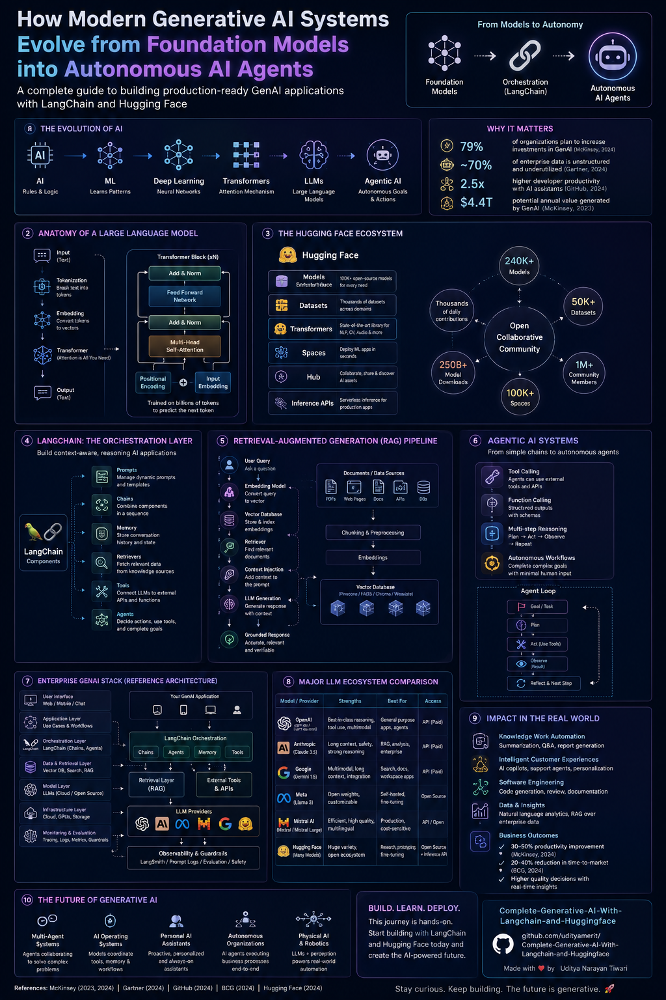

# 🚀 Complete Generative AI With LangChain and Hugging Face

<div align="center">


### Master Generative AI from Basics to Advanced with Real-World Projects

</div>

---

# 📌 Overview

Welcome to the **Complete Generative AI With LangChain and Hugging Face** repository — a complete hands-on course designed to help you understand, build, deploy, and optimize modern Generative AI applications using cutting-edge technologies like **LangChain**, **Hugging Face**, **LLMs**, and **RAG Pipelines**.

This repository contains practical implementations, tutorials, deployment strategies, and real-world AI projects that guide learners from beginner-level concepts to advanced production-ready AI systems.

Whether you are an:

* AI Enthusiast
* Developer
* Machine Learning Engineer
* NLP Practitioner
* Student
* Researcher

this course will help you gain practical experience in creating intelligent AI-powered systems.

---

---

# 🎯 What You Will Learn

## 🧠 Introduction to Generative AI

* Fundamentals of Generative AI
* Understanding Large Language Models (LLMs)
* Traditional AI vs Generative AI
* Applications of Generative AI

---

## 🔗 LangChain Fundamentals

* Introduction to LangChain
* Chains and Sequential Workflows
* Agents and Tools
* Prompt Templates
* Memory Management
* LangChain Architecture

---

## 🤗 Hugging Face Integration

* Hugging Face Transformers
* Pre-trained Models
* Model Pipelines
* Tokenizers
* Fine-Tuning Models
* NLP Applications using Hugging Face

---

## 📚 Retrieval-Augmented Generation (RAG)

* Understanding RAG Pipelines
* Embeddings and Vector Databases
* Semantic Search
* Document Retrieval
* Context-Aware AI Systems
* Improving AI Accuracy using Retrieval

---

## 🏗️ Building Generative AI Applications

Learn how to create:

* AI Chatbots
* Question Answering Systems
* AI Assistants
* Text Summarizers
* Content Generators
* Knowledge Base Systems
* AI Automation Tools

---

## ☁️ Deployment Strategies

* Local Deployment
* Cloud Deployment
* API Development
* Docker Integration
* Scalable AI Systems
* Production-Level AI Applications

---

## ⚡ AI Optimization Techniques

* Prompt Engineering
* Model Optimization
* Cost Optimization
* Monitoring AI Systems
* Updating AI Models
* Improving Performance and Reliability

---

## 🛠️ End-to-End Projects

Hands-on real-world projects including:

* RAG-Based AI Assistant
* AI Chatbot
* Intelligent Document Search
* AI Content Generator
* NLP Automation System
* Multi-Document QA System

---

# ✨ Features

✅ Beginner to Advanced Content

✅ Practical Hands-on Learning

✅ Real-World Projects

✅ Industry-Level AI Workflows

✅ LangChain + Hugging Face Integration

✅ RAG Pipeline Development

✅ Deployment Tutorials

✅ Optimization Techniques

✅ Production-Oriented Learning

---

# 🖥️ Technologies Used

| Technology           | Purpose                   |
| -------------------- | ------------------------- |
| Python               | Core Programming Language |
| LangChain            | LLM Application Framework |
| Hugging Face         | NLP & Transformer Models  |
| Transformers         | Deep Learning NLP Models  |
| FAISS / ChromaDB     | Vector Databases          |
| OpenAI API           | LLM Integration           |
| Docker               | Containerization          |
| FastAPI / Flask      | API Development           |
| TensorFlow / PyTorch | Deep Learning Frameworks  |

---

# 📂 Repository Structure

```bash
📦 Complete-Generative-AI-With-Langchain-and-Huggingface
 ┣ 📂 LangChain
 ┣ 📂 HuggingFace
 ┣ 📂 RAG
 ┣ 📂 Projects
 ┣ 📂 Deployment
 ┣ 📂 NLP
 ┣ 📂 VectorDatabases
 ┣ 📂 AI_Agents
 ┣ 📂 Prompt_Engineering
 ┣ 📜 README.md
 ┗ 📜 requirements.txt
```

---

# 📖 Prerequisites

Before starting this course, you should have:

* Basic Python Knowledge
* Understanding of Programming Fundamentals
* Basic Machine Learning Concepts
* Familiarity with APIs
* Basic Command Line Usage

### Recommended (Optional)

* Deep Learning Basics
* TensorFlow or PyTorch Knowledge

---

# 👨‍🎓 Who This Course Is For

This course is ideal for:

* 👨‍💻 Software Developers
* 🤖 AI & ML Enthusiasts
* 📊 Data Scientists
* 🧠 NLP Practitioners
* 🎓 Students and Researchers
* 🚀 Technical Entrepreneurs
* 🛠️ Machine Learning Engineers
* 📚 AI Hobbyists

---

# 🚀 Real-World Applications

Generative AI is transforming industries worldwide. This course helps you build solutions for:

* Customer Support Automation
* AI Content Creation
* Smart Search Engines
* Enterprise Knowledge Systems
* AI Assistants
* Chatbots
* Recommendation Systems
* Intelligent Automation Platforms

---

# 📈 Skills You Will Gain

After completing this course, you will be able to:

✔️ Build Advanced Generative AI Applications

✔️ Create LangChain-Based Workflows

✔️ Integrate Hugging Face Models

✔️ Develop RAG Pipelines

✔️ Deploy AI Applications

✔️ Optimize AI Systems

✔️ Build Production-Level AI Projects

✔️ Work with LLM-Based Architectures

---

# ⚙️ Installation

## Clone the Repository

```bash
git clone https://github.com/udityamerit/Complete-Generative-AI-With-Langchain-and-Huggingface.git
cd Complete-Generative-AI-With-Langchain-and-Huggingface
```

---

# 📦 Install Dependencies

```bash
pip install -r requirements.txt
```

---

# ▶️ Run the Project

```bash
python app.py
```

---

# 📚 Recommended Learning Path

1. Introduction to Generative AI
2. Python & Environment Setup
3. LangChain Basics
4. Hugging Face Transformers
5. Prompt Engineering
6. RAG Pipelines
7. Building AI Applications
8. Deployment Techniques
9. Optimization Strategies
10. End-to-End Projects

---

# 🌟 Why Learn Generative AI?

Generative AI is one of the fastest-growing domains in technology and is widely adopted across industries.

Learning Generative AI helps you:

* Build intelligent applications
* Automate complex workflows
* Improve productivity
* Create AI-powered systems
* Advance your career in AI and ML
* Stay future-ready in technology

---

# 🤝 Contribution

Contributions are welcome!

If you would like to improve this repository:

1. Fork the repository
2. Create a new branch
3. Make your changes
4. Commit your updates
5. Submit a Pull Request

---

# 📜 License

This project is licensed under the MIT License.

---

# 🔗 Repository Link

⭐ Repository:
[Complete Generative AI With LangChain and Hugging Face Repository](https://github.com/udityamerit/Complete-Generative-AI-With-Langchain-and-Huggingface?utm_source=chatgpt.com)

---

# 📬 Contact

## 👤 Uditya Narayan Tiwari

* 🌐 Portfolio: [Portfolio Website](https://udityanarayantiwari.netlify.app/?utm_source=chatgpt.com)
* 💻 GitHub: [GitHub Profile](https://github.com/udityamerit?utm_source=chatgpt.com)
* 🔗 LinkedIn: [LinkedIn Profile](https://www.linkedin.com/in/uditya-narayan-tiwari-562332289/?utm_source=chatgpt.com)
* 📚 Knowledge Base: [Knowledge Base Website](https://udityaknowledgebase.netlify.app/?utm_source=chatgpt.com)

---

<div align="center">

## ⭐ If You Found This Repository Helpful, Please Star the Repository!

### 🚀 Happy Learning and Building with Generative AI 🚀

</div>
